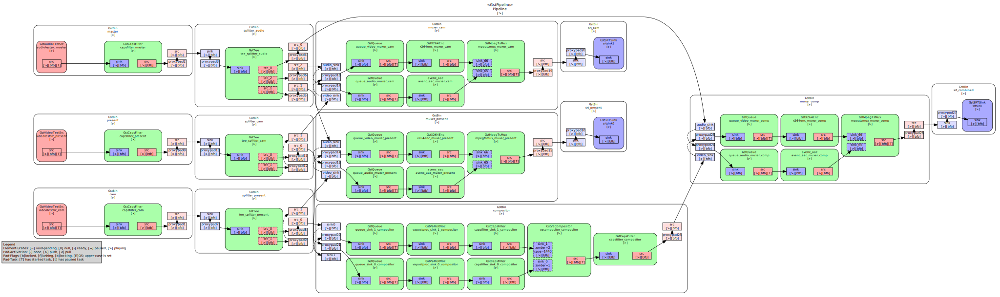

# streamd - A streaming daemon for streaming multiple live sources.

This daemon handles the processing of audio and video streams from multiple
sources, enabling real-time streaming and recording. It is designed to run on
edge servers, typically in environments such as lecture halls, and uses
off-the-shelf hardware for cost efficiency and flexibility.

## Design

'streamd' uses GStreamer for capturing from live sources, multiplexing,
processing, and streaming via
[SRT](https://www.haivision.com/products/srt-secure-reliable-transport/).

The overall design off the daemon focuses on simplicity and clearity, avoiding
leaky abstractions on top of GStreamer. The user should know the basic concepts
of GStreamer and be able to construct simple pipelines via `gst-launch-1.0`.

The daemon provides a Prometheus metrics endpoint which includes CPU, Memory,
I/O, SRT Connection, and pipeline metrics.

The pipeline's filter graph only contains functionality required for basic
live-streaming. Processing elements are packed into reusable bins (see `gstreamer_bins.go`).
Bins usually resemble physical components such as sources or splitters.

Features like scheduled recordings are out of scope to reduce
complexity and increase resilience. 

## Example Filter graph

This is a filter graph from a `streamd` instance with hardware acceleration enabled.

### An overly simplified diagram of the software stack

```
    ┌───────────────────────────────────────────────────────┐
    │                        streamd                        │
    └───────────────────────────────────────────────────────┘
    ┌───────────────────────────┐┌──────────────────────────┐
    │    GStreamer Framework    ││                          │
    └───────────────────────────┘│     Decklink Library     │
    ┌───────────────────────────┐│                          │
    │          VA API           ││                          │
    └───────────────────────────┘└──────────────────────────┘
    ┌───────────────────────────────────────────────────────┐
    │  ┌───────────┐┌───────────┐┌────────────┐┌─────────┐  │
    │  │   V4L2    ││ Decklink  ││    ALSA    ││   DRM   │  │
    │  │ Subsystem ││           ││ Subsystem  ││         │  │
    │  └───────────┘└───────────┘└────────────┘└─────────┘  │
    │                        Kernel                         │
    └───────────────────────────────────────────────────────┘
    ┌───────────────────────────────────────────────────────┐
    │                       Hardware                        │
    └───────────────────────────────────────────────────────┘
```

## Building

`streamd` only runs on a Linux distribution and architecture supported by Go. To
compile the daemon, install all dependencies or enter the nix development shell
and run `go build`.

### Dependencies

If you have [nix/nixos](https://nixos.org/) just enter the development shell with `nix-shell` in the repository root.

- Go
- A working C compiler
- pkg-config
- Glib
- GStreamer
- GStreamer Plugins Ugly
- GStreamer Plugins Bad
- GStreamer Plugins Base
- GStreamer Plugins Good
- GStreamer libav

Take a look at `nix.shell` in the repository root for a detailed list.


## Usage

The following flags configure the streamd daemon:

	-audio-enc-bitrate int
		Video encoding bitrate in Kbps (default 96)

	-http-port string
		Port at which to listen for HTTP requests (default "8080")

	-hw-accel
        Enable hardware acceleration and offload processing tasks onto the GPU or a DSP

	-port-cam-srt string
		SRT listing port for camera stream (default "7002")

	-port-comb-srt string
		SRT listing port for combined stream (default "7000")

	-port-present-srt string
		SRT listing port for presentation stream (default "7001")

	-source-audio string
		GStreamer element factory name for the audio source (default "audiotestsrc")

	-source-audio-opts string
		GStreamer element properties for audio source

	-source-cam string
		GStreamer element factory name for the camera source (default "videotestsrc")

	-source-cam-opts string
		GStreamer element properties for camera source

	-source-present string
		GStreamer element factory name for the presentation source (default "videotestsrc")

	-source-present-opts string
		GStreamer element properties for presentation source

	-listen-cidr string
		CIDR containing Address to listen for all srt requests. E.g. 100.64.0.0/10 for tailnets. If unset, [::] will be listened on.

	-video-enc-bitrate int
		Video encoding bitrate in Kbps (default 6000)

For details on SRT URIs, see: https://github.com/hwangsaeul/libsrt/blob/master/docs/srt-live-transmit.md.

## HTTP API

- **`HTTP GET /metrics`**  
  Prometheus metrics endpoint.

- **`HTTP GET /graph?details=<OPTIONAL_DETAILS_QUERY>`**  
  Retrieve the current filter graph as `text/vnd.graphviz`.  

  `OPTIONAL_DETAILS_QUERY` options:  
  - `media-type`  
  - `caps`  
  - `non-default-params`  
  - `states`  
  - `full-params`  
  - `all`  
  - `verbose`

## Examples

### V4L2 and ALSA stream with hardware acceleration:
```
streamd -hw-accel \
    -source-cam v4l2src -source-cam-opts "device=/dev/video0" \
    -source-present v4l2src -source-present-opts "device=/dev/video2" \
    -source-audio alsasrc -source-audio-opts "device=hw:2,0"
```